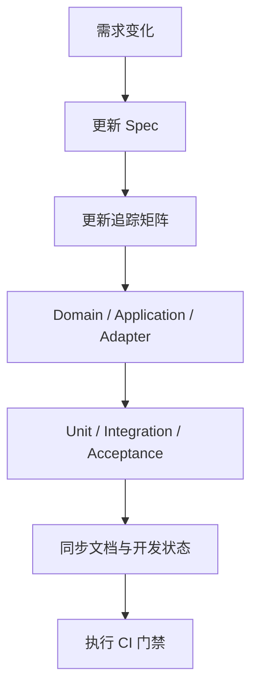

# 开发变更链路

```mermaid
flowchart TD
    Requirement["需求变化"] --> Spec["更新 Spec"]
    Spec --> Matrix["更新追踪矩阵"]
    Matrix --> Code["Domain / Application / Adapter"]
    Code --> Tests["Unit / Integration / Acceptance"]
    Tests --> Docs["同步文档与开发状态"]
    Docs --> CI["执行 CI 门禁"]
```
