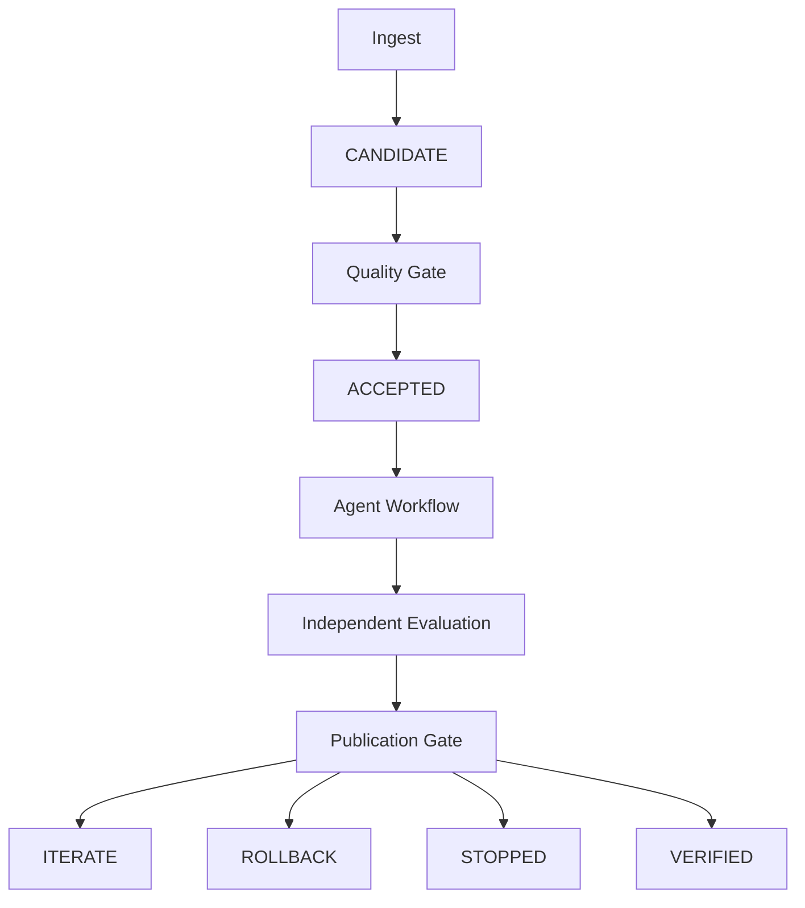

# 知识生命周期

```mermaid
flowchart TD
    Ingest["Ingest"] --> Candidate["CANDIDATE"]
    Candidate --> Quality["Quality Gate"]
    Quality --> Accepted["ACCEPTED"]
    Accepted --> Workflow["Agent Workflow"]
    Workflow --> Evaluation["Independent Evaluation"]
    Evaluation --> Gate["Publication Gate"]
    Gate --> Iterate["ITERATE"]
    Gate --> Rollback["ROLLBACK"]
    Gate --> Stopped["STOPPED"]
    Gate --> Verified["VERIFIED"]
```

`ACCEPTED` 只表示候选具备进入行为评测的条件；只有完整证据通过发布 Gate，才能进入 `VERIFIED`。
