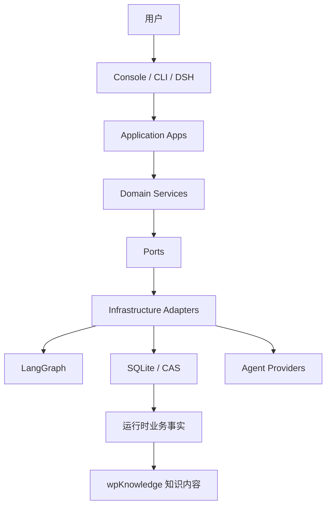

# 系统总览

```mermaid
flowchart TD
    User["用户"] --> Interface["Console / CLI / DSH"]
    Interface --> App["Application Apps"]
    App --> Domain["Domain Services"]
    Domain --> Ports["Ports"]
    Ports --> Infra["Infrastructure Adapters"]
    Infra --> Workflow["LangGraph"]
    Infra --> Storage["SQLite / CAS"]
    Infra --> Provider["Agent Providers"]
    Storage --> Facts["运行时业务事实"]
    Facts --> Knowledge["wpKnowledge 知识内容"]
```

对应源码：Application 在 `src/application/`，领域服务在 `src/domain/`，适配器在 `src/infrastructure/`，入口在 `src/interfaces/`。
