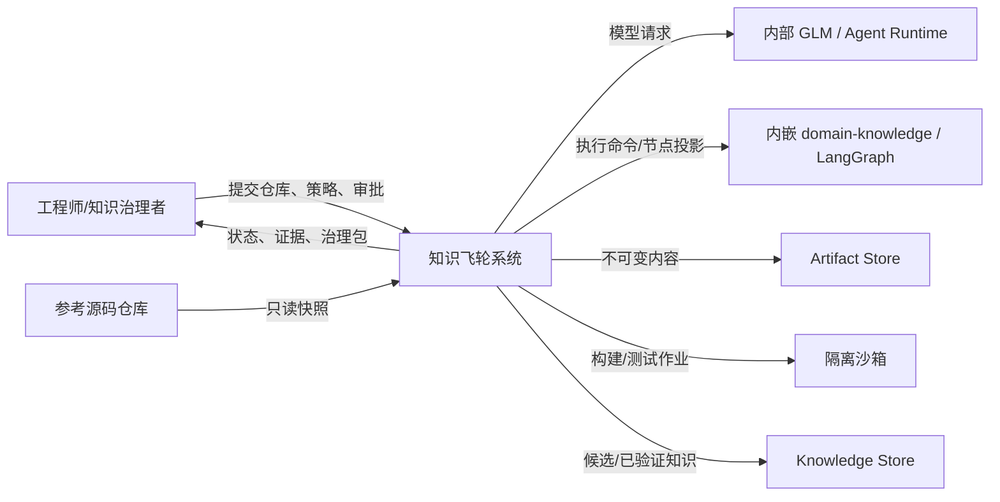
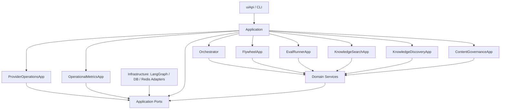

# 系统上下文

## 边界与端口

系统内部按以下 DDD 依赖方向组织：

Domain Service 包含 `FlywheelDomainService`、`EvalRunnerDomainService` 和 `AssociationDomainService`。具体 Agent Runtime、数据库驱动和 Redis 客户端均为 Infrastructure 实现，不进入 Domain。

| 端口 ID | 外部系统 | 核心看到的类型 | 责任 |
|---|---|---|---|
| PORT-001 | Agent Runtime / GLM | `AgentRequest`, `AgentResult` | 结构化生成、取消、超时、用量；由 Provider 适配。 |
| PORT-002 | Artifact Store | `ArtifactRef` | 内容寻址、原子写、摘要校验。 |
| PORT-003 | Sandbox | `ExecutionRequest`, `ExecutionResult` | 隔离执行和资源计量。 |
| PORT-004 | Knowledge Store | `KnowledgeVersion` | 候选、血缘、状态、发布事务。 |
| PORT-005 | 内嵌 Workflow Engine | `WorkflowCommand`, `WorkflowHandle`, `WorkflowNodeProjection` | LangGraph 节点、边、并行、循环、checkpoint、恢复与状态投影。 |
| PORT-006 | Language Plugin | `LanguageCapability` | 发现、构建、执行与标准化诊断。 |
| PORT-007 | Runtime State Store | `AgentContextStore`, `RunningStateStore` | 保存可重建 Agent 上下文与运行租约；不得持有知识和发布事实。 |

DSH、LangGraph、GLM SDK、数据库驱动和 C++ 工具链均位于领域与应用核心外侧；其 SDK 类型不得跨越端口。当前 `domain-knowledge` 以内嵌基础设施模块实现 PORT-005，不是独立服务，也不拥有 Run、知识、评测或发布事实。
