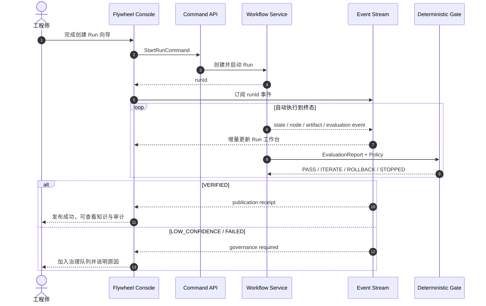
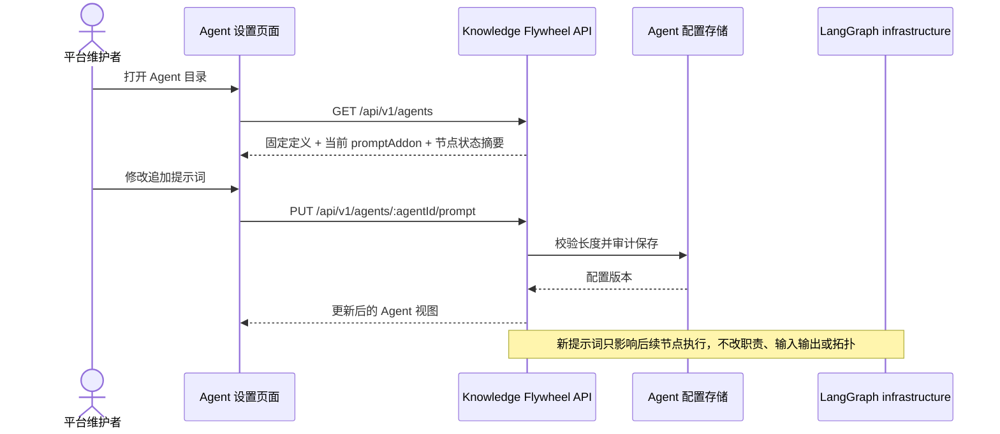

# 知识飞轮前台产品设计

**状态：Accepted；F2 最终 UI/UX 已冻结，F4/F5 已接线｜版本：0.6.0｜日期：2026-09-04**

本文定义 domain-knowledge 知识飞轮控制台的用户体验、信息架构、交互边界、接口需求和验收标准。领域状态、门禁、安全和发布语义以同仓库的[规范总入口](../README.md)为准；前台不得创造第二套状态或发布权威。

关联规范：

- [用户用例与交互时序](../05-workflows/user-use-cases.md)
- [知识飞轮工作流](../05-workflows/knowledge-flywheel-workflow.md)
- [数据边界与权限矩阵](../09-security/data-boundaries.md)
- [知识发布门禁](../08-evaluation/knowledge-publication-gate.md)

## 1. 产品定位

前台不是 Agent 聊天室，也不是让用户逐步点击状态转换的工作流调试器。它是：

> 面向工程师和知识治理者的本地优先控制台，用于启动自动知识飞轮、观察证据链、处理异常治理，并安全消费已经发布的知识。

### 1.1 产品目标

1. 用户用一个高层动作启动 Run，Workflow Service 自动推进正常路径。
2. 用户能够回答“现在运行到哪里、为什么停下、用了什么证据、发布了哪个版本”。
3. `CANDIDATE`、质量合格、Gate `PASS` 和 `VERIFIED` 在视觉与文案上严格区分。
4. 只有需要人类判断的异常进入治理队列，正常迭代不要求人工逐节点操作。
5. 任一关键结果都能沿 `Run → Agent node → Artifact → Evaluation → GateDecision → Publication` 追溯。

### 1.2 非目标

- 不提供任意状态跳转按钮。
- 不允许用户在页面上直接把候选标记为 `VERIFIED`。
- 不把模型流式文本、思维过程或 Agent 自评分当成进度或证据。
- 不在第一阶段实现通用 IDE、源码编辑器或复杂工作流画布编辑器。
- 不把受信项目 EvalRunner 描述成敌对代码沙箱。

## 2. 用户角色与核心任务

| 角色 | 核心任务 | 默认权限 |
|---|---|---|
| 知识消费者 | 搜索 `VERIFIED` 知识、查看来源、提交使用反馈 | 只读 + feedback |
| 工程师 | 选择项目和模块、启动 Run、观察自动迭代、取消自己的 Run | 受保护写入 |
| 知识治理者 | 查看 Correction、处理 `LOW_CONFIDENCE`、批准重新运行或创建新候选 | 受保护写入 |
| 发布验收者 | 查看固定 commit、测试命令、工具链、Gate 和 publication receipt | 只读审计；受控重跑 |
| 平台维护者 | 配置 Provider、Policy、评测器和安全边界，诊断基础设施失败 | 本地管理员 |

## 3. 产品原则

### 3.0 前台术语

用户可见界面以自然中文为主，品牌名、项目名、`Agent`、API/协议缩写、代码字段、枚举原值和不可翻译的技术标识符除外。`Registry` 统一写作“注册”；`Agent` 不翻译为“智能体”；`Run` 作动作时写作“运行”，作实体名词时写作“批次”。同一组件不得同时使用未经批准的中英文同义标签。

### 3.1 证据优先

界面先展示确定性事实：状态、测试结果、reason code、ArtifactRef、commit、工具链和 receipt。Agent 名称、模型和耗时是辅助信息，不占据主视觉中心。

### 3.2 自动化可见，但不要求人工遥控

正常路径由 Workflow Service 自动推进。界面展示状态图、节点和事件，但不为 `PLANNED → GENERATING → EVALUATING` 提供人工“下一步”按钮。用户只看到符合当前状态和权限的高层动作。

### 3.3 失败可理解

错误必须归入以下一种用户可理解类别：

- 行为失败：测试或关键门禁未通过。
- 知识问题：Correction 已定位知识路径。
- 基础设施失败：工具、超时、资源或 Provider 不可用。
- 安全拒绝：权限、路径、命令或完整性校验失败。
- 预算停止：迭代上限或停滞策略触发。

### 3.4 渐进披露

概览只展示结果和需要注意的事项；Run 详情展示节点；Evidence Drawer 才展示 argv、摘要和 ArtifactRef；完整原始 Artifact 需要显式打开且受权限控制。

### 3.5 高风险动作显式确认

取消运行、以新策略重跑、发布例外申请和治理决议必须展示影响范围。普通查询、查看证据和下载审计摘要不需要确认。

## 4. 信息架构

### 4.1 实现目录边界

本产品控制台的新增代码必须收口在 domain-knowledge：

```text
domain-knowledge/
├── acceptance/            # 固定源码验收 fixture
├── src/
│   ├── domain/              # 领域模型与确定性业务规则
│   ├── application/
│   │   ├── ports/           # 应用端口契约
│   │   └── services/        # 用例编排
│   ├── infrastructure/      # 持久化、评测器、智能体与工作流实现
│   └── interfaces/          # 命令行、服务接口与外部适配入口
├── docs/                  # 架构、运维、迁移
├── specs/                 # 产品、需求、工作流、Schema 与验收规范
├── site/                  # 双主题 GitHub Pages 项目官网
├── tests/                 # unit、contract、integration、acceptance
└── web/                   # HTML、CSS 与浏览器交互
```

控制台服务适配器与只读投影分别位于 `src/interfaces/runner/server.ts` 和 `src/interfaces/runner/console-read-model.ts`。控制台不得为了页面查询扩张 `src/application/services`、`src/application/ports` 或写侧持久化仓库；状态变更仍只能委托共享应用服务。

```text
Knowledge Flywheel
├── 操作中心
│   ├── 系统健康
│   ├── 运行指标
│   ├── 需要处理
│   └── 最近批次
├── 飞轮批次
│   ├── 批次列表
│   ├── 创建批次
│   └── 批次工作台
│       ├── 自动化状态图
│       ├── Agent 节点
│       ├── 评测与 Gate
│       ├── Correction / 版本变化
│       └── 事件与证据
├── 知识
│   ├── 知识目录
│   ├── 版本详情
│   ├── 版本血缘与 Diff
│   └── 使用反馈
├── 工作流图
│   └── 所选批次的 Agent 拓扑、节点状态和详情
├── 评测
│   └── 评测报告、Gate、证据与规则
├── 来源
│   └── 来源注册、状态、漂移、刷新与扫描候选
└── Agent 设置
    ├── Agent 目录与固定契约
    ├── 当前 Provider / 运行健康
    └── 追加提示词、模型 API 配置与运营指标
```

“工作流图”不是工作流画布编辑器。节点名称、职责、依赖、输入输出 Schema、可读写范围和工具权限来自服务端固定定义，只读展示。治理模式下仅可修改 `promptAddon`；前台不得提交任意 Agent 类型、Provider 类名、节点边或 Schema。

### 4.2 最终 UI/UX 裁决

`web/prototype/` 中保存的 PR #2 原型是 F2 布局、密度、组件层级、组件语义和绿色强调色的规范性视觉基准，不得以“适配真实产品”为由替换 `Knowledge Health`、四阶段 Flywheel、`Recent Pulse`、`New run` 等信息结构。运行时事实、可用动作、状态名称和权限仍以服务端 API 与本规范为准；缺失 API 时保留原组件位置并显示 `—`、Empty、Partial 或 Disabled，原型演示值不是产品契约。

F1 的八入口信息架构已经被 F2 取代，不再是有效产品设计。生产导航唯一有效版本为“操作中心、飞轮批次、知识、工作流图、评测、来源、Agent 设置”。其中：

- 操作中心读取服务端持久化待处理事项、组件健康、跨批次活动和知识健康度，不从浏览器临时拼装治理事实。
- 来源页默认展示持久化来源注册；`GET /api/v1/sources/scan` 只有在用户明确扫描时展示候选，不得覆盖或冒充注册事实。
- 工作流图复用批次工作台的真实节点投影，不是 Knowledge Graph；Knowledge Health、跨批次 Activity 和可证明进度已接入服务端，ETA、多项目切换和用户身份继续保持 Partial 或 Disabled。
- 页面只能展示服务端事实或本节允许的派生值。派生值必须能说明输入字段和计算规则，不得伪装成服务端指标。
- API 失败、部分响应或空结果分别进入 Error、Partial 或 Empty 状态，不得回退到原型演示数据。

## 5. 全局界面框架

```text
┌───────────────────────────────────────────────────────────────────────────┐
│ ◇ Knowledge Flywheel   [环境: Local] [只读/治理模式] [系统健康] [用户]   │
├──────────────┬────────────────────────────────────────────────────────────┤
│ 操作中心     │ 页面标题                                      主要动作    │
│ 飞轮批次     ├────────────────────────────────────────────────────────────┤
│ 知识         │                                                            │
│ 工作流图     │                    页面主内容                              │
│ 评测         │                                                            │
│ 来源         │                                                            │
│ Agent 设置   │                                                            │
│              │                                                            │
├──────────────┴────────────────────────────────────────────────────────────┤
│ Runtime · Registry · CAS · Provider · Evaluator 状态                     │
└───────────────────────────────────────────────────────────────────────────┘
```

全局规则：

- 左侧导航固定，操作中心显示待处理数量。
- 顶栏持续显示当前运行环境和权限模式，避免用户误以为只读页面可以写入。
- 第一阶段全局搜索覆盖 Knowledge 关键词；Run ID、moduleId 和 versionId 通过对应列表和详情定位。Artifact 全局检索在专用 API 可用前不作承诺。
- 系统健康不是单一绿色圆点，而是 Registry、CAS、Provider、Evaluator 的分项状态。

## 6. 核心页面设计

### 6.1 操作中心

操作中心用于回答三个问题：系统是否正常、飞轮是否在工作、我是否需要介入。第一阶段的待处理条目是批次级投影，仅允许从 `FAILED`、`LOW_CONFIDENCE` 或最新 GateDecision=`STOPPED` 的真实数据产生。

```text
┌─ 今日运行 ─────┬─ VERIFIED ─────┬─ 自动迭代 ────┬─ 待治理 ─────────┐
│ 12             │ 38             │ 7             │ 3                │
│ 成功 8 / 运行 2 │ 本周 +5        │ 平均 1.6 轮    │ 1 安全 / 2 停止 │
└────────────────┴────────────────┴───────────────┴──────────────────┘

需要处理
┌────────────────────────────────────────────────────────────────────┐
│ HIGH  ohmyworkpanel-mentions · STOPPED · 迭代预算耗尽  [查看]     │
│ MED   cpp-parser · INFRA_FAILURE · evaluator unavailable [诊断]  │
└────────────────────────────────────────────────────────────────────┘

最近批次
Module             State          Iteration   Gate       Updated
mentions           EVALUATING     1/5         —          2m
connector-routing  VERIFIED       2/5         PASS       1h
```

禁止使用虚构的“AI 信心分”。指标必须来自 Registry、EvaluationReport 或事件聚合；Coverage、Freshness、Accuracy、趋势百分比、ETA 和全局活动流在没有专用服务端口径时不得展示数值。

### 6.2 创建批次

采用三步向导，最终提交的是高层 `StartRunCommand`，不是一组裸状态转换。

1. **来源**：选择已配置项目、固定 commit、模块和公开接口范围。
2. **策略**：选择 GatePolicy、最大迭代、评测器和允许的工具。
3. **确认**：展示可访问路径、命令白名单、预计资源和安全边界。

提交后界面立即进入批次工作台；Workflow Service 负责后续状态推进。

必须在确认页突出显示：

- 固定 commit 与当前 checkout HEAD 的区别。
- 是否为受信源码执行。
- 当前执行器是否具备 OS 级隔离。
- Agent Provider 是真实模型还是 deterministic scenario。

### 6.3 批次工作台

这是产品的核心页面。

```text
┌ mentions / run_fad0... ───────────── EVALUATING · Iteration 2/5 ───────┐
│ fixed commit cfef082 · policy local-v1 · trusted-source evaluation      │
│ [取消 Run] [导出审计]                                                   │
├─────────────────────────────────────────────────────────────────────────┤
│ CREATED ✓ → PLANNED ✓ → GENERATING ✓ → EVALUATING ● → REVIEWING       │
│                                    ↖ ITERATING 1                         │
├───────────────────────────────────────────────┬─────────────────────────┤
│ 自动化节点                                    │ 当前节点                │
│                                               │ EvalRunner · attempt 2  │
│ Reference Gate  ✓ 1/1                         │ elapsed 00:42           │
│ DocGen v1       ✓  artifact...                │ command 2/4             │
│ CodeGen v1      ✓                             │                         │
│ Eval v1         ✕ 0/1                         │ [查看实时事件]          │
│ Review          ✓  COR-0001                   │ [查看证据摘要]          │
│ DocGen v2       ✓  changed: 行为规则          │                         │
│ CodeGen v2      ✓  fresh                      │                         │
│ Eval v2         ●                             │                         │
├───────────────────────────────────────────────┴─────────────────────────┤
│ 时间线  10:21 EvalStarted · 10:20 NodeCompleted · 10:18 ArtifactCommitted│
└─────────────────────────────────────────────────────────────────────────┘
```

#### 状态与可用动作

| 状态 | 主信息 | 用户动作 |
|---|---|---|
| `CREATED / PLANNED` | 输入、计划、权限和资源声明 | 取消；无“下一步”按钮 |
| `GENERATING` | 当前 Agent、输入引用、Schema 状态 | 取消；查看节点 |
| `EVALUATING` | 命令进度、测试计数、超时和工具链 | 取消；查看证据 |
| `REVIEWING` | Gate reason codes、Correction | 正常路径自动继续 |
| `ITERATING` | 当前轮次、修改知识路径、剩余预算 | 查看 Diff；正常路径自动继续 |
| `ROLLING_BACK` | historical best、回滚原因 | 查看比较；正常路径自动继续 |
| `PUBLISHING` | 事务阶段和 publication key | 只读等待；不得重复点击发布 |
| `VERIFIED` | 版本、GateDecision、receipt | 打开知识；导出审计 |
| `LOW_CONFIDENCE` | 停止原因、未解决风险、建议动作 | 创建治理决议；以新 Run 重试 |
| `FAILED` | 失败类别、最后 checkpoint | 诊断；满足规则时从新 Run 重试 |
| `CANCELLED` | 取消主体、时间、清理结果 | 查看审计 |

### 6.4 Correction 与知识 Diff

Correction 不使用聊天气泡展示，而使用结构化审阅卡：

```text
Correction COR-0001
知识路径      行为规则
失败判据      AC-E2E-001
证据          evaluation sha256:...
风险          mention parsing behavior remains incorrect

知识变化
  未修改  背景
  已修改  行为规则       [展开 Diff]
  未修改  验证方式

范围校验      PASS · 指定章节外字节一致
```

用户可以查看 Correction 和 Diff，但正常 `ITERATE` 不要求点击批准。只有策略明确要求人工批准或进入 `LOW_CONFIDENCE` 时才出现治理动作。

### 6.5 Knowledge 页面

保留当前左右分栏的高效浏览方式，并增加：

- 模块级版本血缘图。
- `CANDIDATE / VERIFIED / SUPERSEDED / LOW_CONFIDENCE` 状态解释。
- Quality Gate 与 Behavioral Gate 分区，禁止把两个分数合并。
- 与上一版本的 Markdown Diff。
- 产生该版本的 Run、Correction、Evaluation 和 receipt 反向链接。
- `hit / rate / correct` 反馈控件；反馈后明确提示“不会直接改变发布状态”。

### 6.6 Evidence 页面

默认展示脱敏摘要：

- Artifact ID、media type、size、完整性状态。
- 来源 commit、工具链 fingerprint、命令、退出码和耗时。
- 测试总数、通过数、稳定性、critical failures。
- Gate reason codes 和策略版本。

stdout/stderr、Prompt 和源码正文依据权限分级。页面不得通过 URL 参数绕过 Artifact 权限。

### 6.7 Governance 队列

治理条目按风险而不是创建时间优先：

1. 安全与完整性拒绝。
2. 关键行为回归或 `ROLLBACK`。
3. `STOPPED / LOW_CONFIDENCE`。
4. 基础设施失败。
5. 用户 `correct` 反馈。

允许的治理结果只有：创建新 Run、补充来源、调整策略后新建 Run、接受当前 `LOW_CONFIDENCE` 状态、取消。不得直接修改既有 GateDecision 或 publication receipt。

## 7. 自动化交互



前台刷新或断线重连后，必须先读取 Run snapshot，再从最后 `event_seq` 续订事件；不得通过前端本地状态猜测 Run 进度。

### 7.1 查看和定制 Agent



## 8. 视觉系统

### 8.1 风格

界面提供深色和浅色两套主题。两者使用同一套语义 token、信息层级和组件尺寸，只改变颜色值与阴影强度。深色适合长时间观察 Run；浅色适合明亮环境、阅读知识正文和打印截图。

| 语义 | 深色 | 浅色 |
|---|---|---|
| 背景 | `#080B10` | `#F4F7F9` |
| 一级表面 | `#10151D` | `#FFFFFF` |
| 二级表面 | `#121A25` | `#F0F4F7` |
| 边框 | `#273140` | `#CBD6DF` |
| 主文字 | `#EEF2F7` | `#17212B` |
| 次文字 | `#9AA8BA` | `#586B7D` |
| 交互强调 | `#55E6B5` | `#0B9D72` |
| 成功 / VERIFIED | `#76EFBD` | `#087C58` |
| 候选 / 等待 | `#FFD27D` | `#92610F` |
| 失败 | `#FF7D8E` | `#B62F48` |
| 治理 / LOW_CONFIDENCE | `#C7A6FF` | `#7250A8` |

颜色必须同时配合图标和文字，不作为唯一状态表达。

前台交付 F1 实现合入前，当前 Console 与项目官网继续共享既有交互强调色 `#71D4FF`（深色）和 `#07769F`（浅色），不得仅修改规范造成实现漂移。绿色目标 token 只在新版 Console、契约测试和本规范同步落地后启用；项目官网是否同步换色另行评审。

Console 使用 `14px` 全局基准；正文和操作文字通常不小于 `11px`，非关键眉标题、状态与元数据可使用 `8–10px`。中文界面优先使用微软雅黑，跨平台依次回退到苹方、Noto Sans CJK SC 等无衬线字体；不得让普通标题、正文、按钮、标签或图形文字回落到宋体等衬线字体。等宽字体只用于代码、ID、哈希、原始技术值和时间等需要定宽识别的事实，不用于普通中文界面文案。中文取消为英文标签设置的字间距，并以 `1.45–1.6` 行高保证识别度。页面在 200% 缩放下必须保持查询、导航、详情与治理状态可用。字体、图标、脚本和样式默认同源提供，不得依赖 Google Fonts 或其他第三方 CDN；既有 Content Security Policy 不得因视觉改版放宽。

### 8.2 组件

- `StateBadge`：领域状态和解释。
- `RunStepper`：合法状态路径与当前节点。
- `NodeCard`：Agent、输入输出、checkpoint、重试次数。
- `GatePanel`：Outcome、reason codes、策略和证据。
- `ArtifactLink`：摘要显示、复制、完整性状态和权限提示。
- `CorrectionCard`：路径、判据、证据、风险和知识 Diff。
- `GovernanceAction`：高风险动作、影响说明和确认。
- `EventTimeline`：按 `event_seq` 排序，不依赖相同时间戳。

### 8.3 主题切换

- 首次访问跟随 `prefers-color-scheme`。
- 用户手动切换后，把 `light` 或 `dark` 偏好写入独立的 `localStorage` key；主题数据不得与治理 token 共用存储。
- 切换按钮必须有可感知名称，并显示切换后的目标主题。
- 官网和本地 Console 分别适配两套主题。项目官网仍是纯静态页面，不得因为主题切换连接 Registry 或写 API。
- 状态色在两套主题下都要保持文字、边框或图标提示；正文与背景应满足 WCAG AA 对比度。

### 8.4 响应式策略

- ≥1200px：固定侧栏，Run 图与当前节点双栏。
- 768–1199px：可折叠侧栏，详情 Drawer。
- <768px：只保证查询、告警确认和 Run 观察；创建策略与复杂 Diff 引导用户使用桌面宽度。

移动端允许把表格转换为卡片，但不得仅通过隐藏列丢失状态、来源或更新时间等关键事实。侧栏应折叠为可关闭导航，打开的详情必须能够通过返回按钮或 Escape 关闭。

## 9. 权限与安全体验

- 未配置 `WP_KNOWLEDGE_WRITE_TOKEN` 时，界面明确进入“只读模式”，隐藏写按钮，并在“设置”中给出完整配置方法。
- 仓库根目录提供 `.env.example`。用户将其复制为默认忽略的 `.env.local`，设置随机长令牌后重启 `npm run knowledge:serve`；启动脚本自动读取该文件。
- 令牌错误显示 `401`，不得伪装成网络故障。
- 令牌不得写入网址、日志或长期浏览器存储；本地第一版只保存在当前页面内存中。
- UI 不直接暴露通用 `transition` 操作；产品动作调用高层 Command API。
- 所有治理动作展示 actor、runId、目标资源和预期副作用，并产生审计事件。
- 安全拒绝必须显示 reason code 和受控摘要，不泄露被拒绝的源码或密钥。

## 10. 状态体验

每个页面必须覆盖：

| 状态 | 产品行为 |
|---|---|
| Loading | 使用骨架屏，避免把零值误认为真实指标。 |
| Empty | 解释为什么为空，并提供符合权限的下一动作。 |
| Stale | 显示最后更新时间和重新连接状态。 |
| Partial | 单个 Evidence/Provider 故障不抹掉已持久化的 Run snapshot。 |
| Unauthorized | 显示只读能力和重新验证入口。 |
| Write disabled | 明确要求服务端配置 token，而不是反复要求用户输入。 |
| Conflict | 显示幂等重放或输入冲突的具体原因。 |
| Terminal | 冻结状态视图，只允许审计、新建 Run 或治理动作。 |

## 11. 前端所需 API

规范性路由、当前实现映射、破坏性迁移清单和所有页面缺口统一见 [Preview HTTP API 规范](../10-interfaces/http-api.md)，本节不再复制可能漂移的接口表。

产品层额外约束如下：

- 首个 Release 前允许直接清理旧路由，但 Server、Console、DSH Adapter、测试和文档必须在同一变更中迁移。
- 操作中心、飞轮批次、工作流图、知识、评测、来源和 Agent 设置均已接入 B2–B4 服务端事实；“知识”仍不实现人工添加精选知识。
- “工作流图”使用所选批次的真实固定 Agent 拓扑、节点投影和 SSE；“评测”使用跨批次读模型，“来源”默认使用持久化注册，不能退回批次聚合或扫描候选冒充。
- “Agent 设置”读取真实固定 Agent 定义，并接入 Provider 安全配置、连接验证和观测指标；编辑失败必须保留原事实并给出受控错误，不得产生假成功。
- 仍未实现的项目空间、ETA、身份和生产 DFX 能力必须隐藏、禁用或明确标记 Preview/Partial，且不得回退到演示数据。

## 12. 产品需求与验收

| ID | 优先级 | 需求 | 验收 |
|---|---|---|---|
| KF-UI-001 | P0 | 用户必须能从一个高层入口启动自动 Run，不接触裸状态转换。 | AC-UI-001 |
| KF-UI-002 | P0 | Run 工作台必须从服务端 snapshot 和事件显示状态、节点、迭代和 Gate。 | AC-UI-002 |
| KF-UI-003 | P0 | 正常 `ITERATE/ROLLBACK/PASS` 路径必须自动推进，前台不得要求逐节点点击。 | AC-UI-003 |
| KF-UI-004 | P0 | Quality Gate 与 Behavioral Gate 必须分区展示，并解释 `ACCEPTED` 不等于 `VERIFIED`。 | AC-UI-004 |
| KF-UI-005 | P0 | 用户必须能从 Run 追踪到 Correction、版本、Evidence、GateDecision 和 receipt。 | AC-UI-005 |
| KF-UI-006 | P0 | 只有 `STOPPED/LOW_CONFIDENCE/FAILED` 或策略要求批准时进入治理队列。 | AC-UI-006 |
| KF-UI-007 | P0 | 只读、未授权和写入关闭必须具有不同且可理解的界面状态。 | AC-UI-007 |
| KF-UI-008 | P0 | 高风险操作必须受权限保护、显式确认、幂等并记录事件。 | AC-UI-008 |
| KF-UI-009 | P1 | 用户可以比较知识版本，并确认 Correction 之外的范围未变化。 | AC-UI-009 |
| KF-UI-010 | P1 | Run 必须支持断线重连和按 `event_seq` 恢复，不丢失已持久化状态。 | AC-UI-010 |
| KF-UI-011 | P1 | 知识消费者可以在不获得发布权限的情况下查询和反馈。 | AC-UI-011 |
| KF-UI-012 | P1 | 界面必须满足键盘导航、可见焦点、语义标签和非纯颜色状态表达。 | AC-UI-012 |
| KF-UI-013 | P1 | 项目官网和本地 Console 必须提供深色/浅色主题，首次跟随系统、允许手动切换并独立保存偏好；主题切换不得持久化治理凭据或改变领域状态。 | AC-UI-013 |
| KF-UI-014 | P0 | Agent 设置页面必须显示全部 Agent 的固定职责、输入输出、基础提示词和追加提示词；每个批次中的 Agent 节点状态在批次工作台和工作流图显示。 | AC-UI-014 |
| KF-UI-015 | P0 | 治理模式只能修改 Agent 的追加提示词；服务端必须拒绝任何拓扑、职责、Schema、Provider 实现或权限替换。 | AC-UI-015 |
| KF-UI-016 | P0 | Run 工作台必须显示 LangGraph 节点投影，并明确区分执行状态与 FlywheelRun 业务状态。 | AC-UI-016 |
| KF-UI-017 | P1 | 项目官网和控制台的用户可见文案必须使用自然、统一的中文；品牌、项目名、`Agent`、API/协议缩写、代码字段、枚举原值和技术标识符可以保持原值，其他栏目名、状态名或说明句不得中英文混用。 | AC-UI-017 |
| KF-UI-018 | P0 | 写入关闭时，设置页必须提供 `.env.local` 的创建位置、变量示例和重启方式；配置前所有写操作仍默认拒绝，治理令牌只保存在页面内存中。 | AC-UI-018 |
| KF-UI-019 | P0 | 前台只能展示服务端事实或具有公开计算规则的派生值；缺少领域模型或 API 支持的指标、身份、问题和关系不得以模拟数据呈现。 | AC-UI-019 |
| KF-UI-020 | P2 | 左上角项目空间必须在后续阶段升级为真实选择器；选择项、当前项目空间和切换后的数据范围均由服务端事实驱动，本阶段不得实现无效下拉框。 | AC-UI-023 |
| KF-UI-021 | P1 | 设置页必须支持本地管理员配置模型 API URL 与 API Key；有效配置启用后，新任务默认使用 Pi Agent 工具执行，且不得削弱既有 Agent 权限、隔离、审计和 Gate。 | AC-UI-024 |

### 12.1 验收场景

| ID | Given / When / Then |
|---|---|
| AC-UI-001 | Given 有效来源和 Policy，When 用户确认创建 Run，Then 系统返回 runId 并自动进入工作流，页面没有手动状态推进控件。 |
| AC-UI-002 | Given 一个活动 Run，When 打开工作台，Then 状态、迭代、节点和事件均来自服务端且刷新后保持一致。 |
| AC-UI-003 | Given 首轮评测失败且预算充足，When Gate=`ITERATE`，Then Review、局部修订、fresh CodeGen 和复评自动发生。 |
| AC-UI-004 | Given Quality=`ACCEPTED` 但无 PASS Gate，When 查看知识，Then 页面仍显示 `CANDIDATE` 并禁止发布表述。 |
| AC-UI-005 | Given 一个 `VERIFIED` 版本，When 从详情逐层导航，Then 能定位原 Run、输入、Correction、评测证据、Gate 和 receipt。 |
| AC-UI-006 | Given Gate=`STOPPED`，When事件到达，Then Run 进入治理队列，页面说明原因、未解决风险和允许动作。 |
| AC-UI-007 | Given未配置 token、错误 token 和有效 token，When进入控制台，Then分别显示只读、未授权和治理模式。 |
| AC-UI-008 | Given用户取消活动 Run，When确认影响，Then请求带幂等键，重复提交只产生一个取消结果和审计事件。 |
| AC-UI-009 | Given Correction 仅指向一个知识章节，When查看 v1/v2 Diff，Then明确显示目标章节变化和范围校验结果。 |
| AC-UI-010 | Given浏览器在第 N 个事件后断线，When恢复，Then先读取 snapshot，再从 N 后续传且事件不重不漏。 |
| AC-UI-011 | Given只读知识消费者，When查询并提交 feedback，Then反馈被记录但知识状态和 GateDecision 不变。 |
| AC-UI-012 | Given仅键盘和屏幕阅读器，When完成查询并打开 Run Gate，Then焦点顺序、名称、状态和错误均可感知。 |
| AC-UI-013 | Given 系统主题为浅色、无已保存偏好，When 首次打开官网或 Console，Then 使用浅色 token；When 用户切换深色并刷新，Then 主题保持且页面没有保存治理 token、发出写请求或改变 Run 状态。 |
| AC-UI-014 | Given 已启动或未启动工作流，When 打开 Agent 设置页面和批次工作台，Then 七类 Agent 均可查阅，固定契约与可编辑提示词分离，节点状态按 runId 展示。 |
| AC-UI-015 | Given 有效写 token，When 保存 promptAddon，Then 后续执行使用该值并产生审计；When 请求包含 role、inputs、outputs、tools 或 edges，Then 服务端拒绝。 |
| AC-UI-016 | Given LangGraph 正在运行，When 打开 Run 工作台，Then 页面从 Knowledge Registry 的节点投影显示 pending/running/completed/failed，不把 graph route 当成知识发布状态。 |
| AC-UI-017 | Given 用户打开项目官网或控制台，When 阅读栏目、状态、说明和错误提示，Then 除品牌、项目名、`Agent`、API/协议缩写、代码字段、枚举原值和原样技术标识符外，页面不出现英文栏目或未经批准的中英文拼接句；`Registry` 写作“注册”，`Run` 的动作与实体语义分别写作“运行”与“批次”。 |
| AC-UI-018 | Given 服务端未配置写入令牌，When 用户点击治理模式或打开设置页，Then 页面引导其从 `.env.example` 创建 `.env.local`、设置 `WP_KNOWLEDGE_WRITE_TOKEN` 并重启服务；令牌不会被写入网址或本地存储。 |
| AC-UI-019 | Given 服务端只提供当前已实现 API，When 用户访问新版控制台全部页面或任一 API 失败，Then 页面保留原型规定的信息结构，但只显示服务端事实、规范允许的派生值或明确的 `—`/Empty/Partial/Disabled 状态，不显示模拟 Knowledge Health、ETA、Graph、Action Item、Activity、Workspace 或用户身份数据。 |
| AC-UI-020 | Given Chromium 视口固定为 `1363 × 936`，When 打开浅色操作中心，Then 顶栏高度为 `103px`、标题顶部位于 `40–45px`、操作区垂直居中、全局字号为 `14px`，并通过已提交基准图的像素回归。 |
| AC-UI-021 | Given 用户在七个一级页面之间导航，When 页面完成渲染，Then Topbar 是唯一的页面级标题来源，内容区不得重复同名标题或增加无功能含义的眉标题、副标题和说明卡。 |
| AC-UI-022 | Given 用户打开中文 Console，When 浏览正文、标题、按钮、标签和工作流图，Then 这些界面文字使用以微软雅黑为首选的中文无衬线字体栈；只有代码、ID、哈希、原始技术值和时间允许使用等宽字体，普通中文文案不得回落到宋体。 |
| AC-UI-023 | Given 服务端提供项目空间列表和当前选择，When 用户从左上角切换项目空间，Then 全部页面按所选项目空间重新查询且不泄露其他空间的数据；URL 或会话可以恢复选择，不可用或无权限的空间给出明确错误并保留原选择。 |
| AC-UI-024 | Given 本地管理员在设置中提交合法 API URL 和 API Key，When 无副作用连接验证成功并启用配置，Then 新任务默认通过 Pi Agent 工具执行；界面和查询接口只显示脱敏配置状态，完整 Key 不进入 URL、日志、浏览器持久化或运行快照；验证失败时分类提示并失败关闭。 |

## 13. 实施阶段

### 前台交付 F1：现有 API 上的产品视觉收敛（历史阶段，已被 F2 取代）

- 使用 `web/prototype/` 的布局和视觉层级重构现有 Console，但保留 `web/app.js` 的真实 API、鉴权和状态语义。
- F1 曾使用八入口结构；该结构仅保留为演进记录，不得用于新增页面、测试或文档。
- 用契约测试验证中文排版、双主题、同源资源、键盘可达、状态真实性和移动端关键路径；操作中心另以固定 `1363 × 936` 的 Chromium 截图执行像素回归。
- 本阶段不得修改 Domain、Application App、HTTP API 或 JSON Schema；若视觉需求触发这些变化，必须先形成独立 Spec 对齐。

### 前台交付 F2：最终七页面与真实 Graph

- 生产导航收敛为“操作中心、飞轮批次、知识、工作流图、评测、来源、Agent 设置”七个页面。
- 七页必须完成最终布局、深浅主题、响应式、键盘路径以及 Loading/Empty/Error/Partial/Disabled 状态；未接 API 不得以演示数据或假成功代替。
- Graph 必须基于选定 Run 的固定 Agent 定义、WorkflowNodeProjection、workflow status 和事件实现真实轮询版，并允许查看节点 attempt、时间、ArtifactRef 与受控错误摘要。
- Graph 采用 LangGraph Studio 的有向工作流表达范式：连接线、箭头、当前路径和节点执行状态必须在同一画布直接映射；不得退化为无连线的卡片网格。Studio 是面向 Agent Server 的调试 IDE，本产品不以 iframe 嵌入，也不开放其线程 fork、状态编辑或提示词调试权限。
- Knowledge 只承诺查询、详情与反馈 Preview；Lineage/Diff 保留禁用入口，Add curated knowledge 不进入本阶段。

### HCP-1：F2 与 B1 人工检查点

结论：`Accepted`。本次用户确认当前版本为最终 UI/UX，七页信息架构、视觉语言、Graph 语义和真实数据边界自此冻结；后续功能接线不得恢复 F1 八入口结构或另行重设计页面。

F2 可访问验收环境和 B1 API 迁移 diff 就绪后，进入 B2/B3 并行开发前必须由产品用户人工检查。检查范围包括七页信息架构、目标视觉一致性、Graph 的 Agent 工作流语义、真实/派生/未接数据标识、危险动作位置，以及新旧 API 映射。

检查结果只允许：

- `Accepted`：页面结构和 API 边界冻结，可以进入 B2/B3。
- `Accepted with follow-ups`：仅有不改变结构和契约的小型视觉问题，记录明确任务后继续。
- `Rework required`：页面分类、Graph 语义、核心操作或数据真实性不成立，阻止 B2/B3 前台接线。

人工检查不替代自动化门禁。提交方必须同时提供公网临时环境、桌面/移动端与双主题证据、逐区域数据来源表、Disabled/Partial 清单、Graph 节点来源说明、B1 路由映射和自动化结果。

### 前台交付 F3：核心控制面接线

- 操作中心接入真实待处理事项、组件健康和活动流，允许受控处理、重试与重新生成。
- 飞轮批次接入可信进度、重试和 SSE；工作流图从轮询升级为可断线续传的实时节点图。
- Knowledge Health 等依赖 B3 数据的指标仍保持 Partial，不得为了完成 F3 提前虚构口径。

### 前台交付 F4：运营最小可用面接线（DEV-007）

- Agent 设置接入真实 Provider 状态。
- 设置页接入模型 API 配置 Use Case：支持 API URL、API Key、脱敏状态和连接验证；服务端持有密钥并提供 `GET/PUT /api/v1/provider-settings` 与 `POST /api/v1/provider-settings/verify`。验证成功后以 Pi Agent 工具作为新任务的默认执行方式；已经冻结为 Pi 的批次失败时不得回退到演示 Provider 或绕过现有安全门禁。未启用有效配置时必须如实展示部署 fallback，默认 fixture 只代表本地验收。
- 接入生成与治理观测：批次/节点 P50/P95、调用、重试、Token、估算成本、自动修订通过率、三轮收敛率、人工介入比例、平均处理时间和短期复发率必须同时显示样本量；无样本时显示空值。

完成结果：上述接口和页面均已接通；API Key 只在页面内存和服务端秘密边界间传递，已经冻结为 Pi 的批次在验证过期、不可用或配置变化时失败关闭。自动化以本地模拟的 OpenAI-compatible 上游验证真实 Pi SDK 七节点执行路径；外部生产凭据和模型效果仍需部署者人工验收。

### 前台交付 F5：内容与质量面接线（DEV-008）

- 知识接入血缘与差异；评测接入独立列表、详情、证据和规则修订；来源接入注册、状态和刷新。
- 知识、评测与来源的基础事实稳定后接入知识健康度，并展示分子、分母、窗口、采样时间与规则版本。

完成结果：知识详情可反向导航批次、Correction、评测和 publication；评测支持筛选、受控证据下载与规则 revision；来源支持注册、启停、刷新、漂移和关联统计；健康度无完整样本时显示空值。

### 前台交付 F6：运营 DFX 加固

- 左上角项目空间升级为可选择控件，接入 `GET /api/v1/workspaces` 与服务端确认的当前空间；各业务查询采用统一的 workspace scope，切换时清理旧空间缓存和在途请求。具体身份、默认空间、URL 持久化与授权模型须在实现前与后台契约一并评审。
- 所有列表、实时连接和高风险操作通过容量、恢复、分页、权限、审计和移动端最终验收；此时才可以移除相应 Preview/Partial/Disabled 标识。

### 系统实施 Phase 1：架构与事实源收敛

- 将 domain-knowledge 迁入独立 infrastructure 目录并接入 WorkflowEngine 端口。
- 固化 FlywheelRun、GraphState、GenerationKey、graph checkpoint 和双 Gate 的所有权。
- 建立 Agent 定义、提示词覆盖和节点执行投影的 Registry Schema。

### 系统实施 Phase 2：ohMyWorkPanel 自动垂直切片

- 以固定 commit 的 ohMyWorkPanel 场景启动真实 LangGraph。
- 打通候选知识、首轮失败、Review、增量修订、fresh Code generation、真实 ProjectEvaluator 和 Knowledge Registry 发布事务。
- 用 GenerationKey 防止 graph checkpoint 边界重放外部副作用。

### 系统实施 Phase 3：Agent 设置与节点可观察性

- 新增 Agent 设置页面、固定 Agent 定义查询和受限 promptAddon 编辑。
- 在 Run 工作台展示 LangGraph 节点执行投影。
- 增加高层 Start/Resume/Cancel API，不向产品 UI 暴露裸状态转换。

### 系统实施 Phase 4：配套材料与生产强化

- 同步 GitHub Pages、快速入门、架构、运维、测试和仓库目录文档。
- 为真实 Agent Provider 增加重复运行统计和健康状态；Scenario 只留在验收 profile。
- 在安全隔离能力完成后开放对应语言项目执行。
- 增加崩溃注入、审计导出、权限细分、可访问性和大规模数据性能验证。

不得在 Phase 2 用前端连续调用 `transition/evaluate/publish` 模拟自动 Orchestrator。自动化必须存在于服务端 Workflow Service，页面只负责命令和观察。

## 14. 当前实现差距

| 能力 | 当前状态 |
|---|---|
| 全局框架、响应式导航和操作中心 | Implemented：桌面侧栏、移动导航、批次指标和能力边界已接入真实 API |
| GitHub Pages 项目官网 | Implemented：纯静态、双主题、响应式，提供使用者命令和 Agent 配置 Prompt；不连接 Registry；站点源码只在 `site/`，分支/Jekyll 模式由根入口嵌入，切到 GitHub Actions Source 后由工作流直接发布该目录 |
| 双主题知识目录、状态筛选、知识详情 | Implemented MVP：官网和 Console 支持深色/浅色切换；目录筛选、搜索、详情 Drawer、provenance 和正文使用同一套语义状态色 |
| Quality / Behavioral Gate 区分 | Implemented：分区展示并解释 `ACCEPTED` 不等于 `VERIFIED`；版本 Diff 与范围校验已接入 |
| Feedback UI | Implemented：使用仅驻留页面内存的 bearer token，明确反馈不改变发布状态 |
| 批次列表与工作台 | Implemented MVP：新增批次列表、snapshot、顺序事件、checkpoint、评测和 Gate API/UI |
| 自动 Run 启动 | Implemented fixed profile：CLI/API/Console 可启动固定 ohMyWorkPanel LangGraph 流程；任意项目的通用来源/策略向导仍在规划 |
| Agent 目录与定制 | Implemented：七个固定角色可查，只有 `promptAddon` 可在治理模式修改并形成 revision/audit |
| LangGraph 节点投影 | Implemented：Run 工作台从 Knowledge Registry 显示节点、Agent、轮次、attempt 与状态，不读取 graph checkpoint |
| 实时事件 | Implemented：批次与活动 SSE 使用持久化 cursor 续传，断线自动重连并退回增量轮询 |
| Correction / Diff | Implemented：通用血缘、结构化 Diff、范围校验和反向关系已接入知识详情 |
| Governance | Implemented MVP：服务端持久化事项、revision、跨重启幂等、审计、受控重试和冻结反馈重新生成均已接入操作中心；完整安全事实事项仍后置 |
| Evidence | Implemented：跨批次评测详情、GateDecision、工具链、测试、规则版本和受控证据下载已接入 |
| 来源注册与知识健康 | Implemented：持久化来源、访问边界、刷新/漂移、关联统计及带样本口径的健康度已接入 |
| 真实在线 Agent | Implemented（Preview）：官方 DSH SDK 与 Pi SDK 七节点执行路径均已自动化跑通；真实外部凭据、模型效果基线和生产容量仍需部署验收 |
| 前台交付 F4 | Implemented：Provider 安全配置/验证、新批次 Pi 默认选择及生成/治理指标已接入 Agent 设置 |
| 前台交付 F5 | Implemented：知识血缘/差异、评测/规则、来源注册和知识健康度已接入七页最终结构 |
| 敌对代码安全执行 | Planned；安全能力完成前必须 fail closed |
| 前台交付 F1 | Superseded：八入口结构仅作为历史实现记录，不再指导产品页面 |
| 前台交付 F2 | Accepted：最终七页、真实 Agent 工作流图、目标站布局与视觉 token、微软雅黑优先字体、双主题和数据真实性边界已冻结 |
