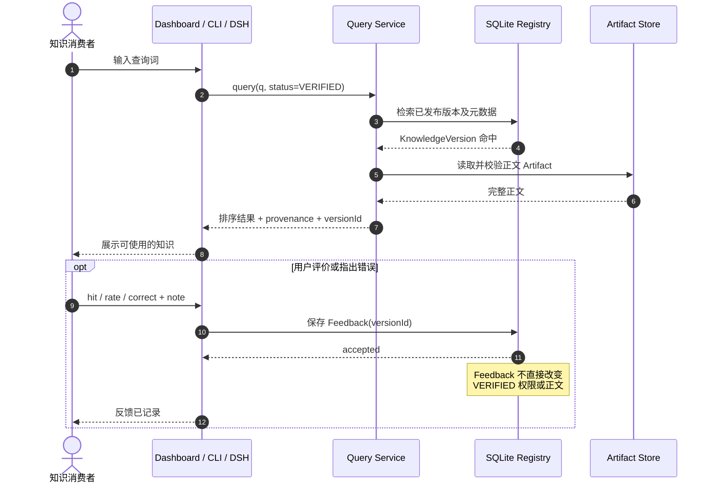
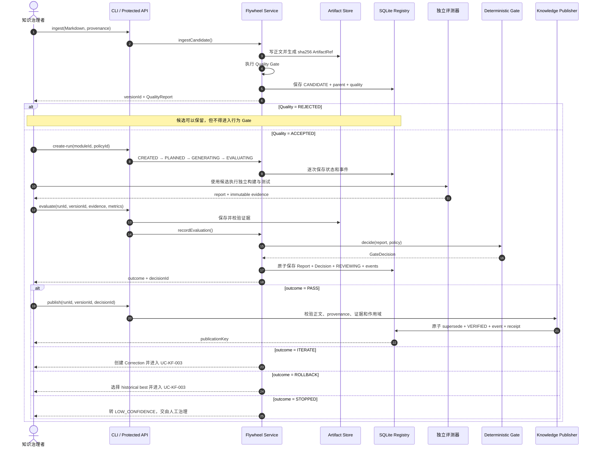
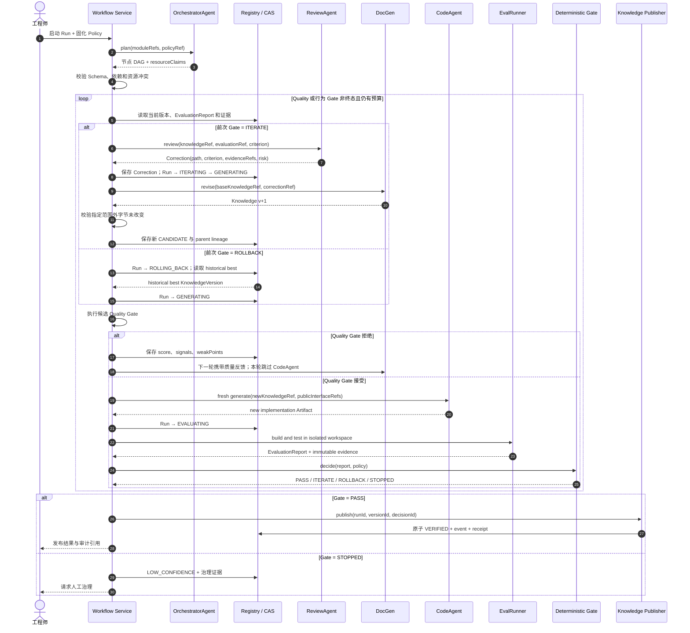
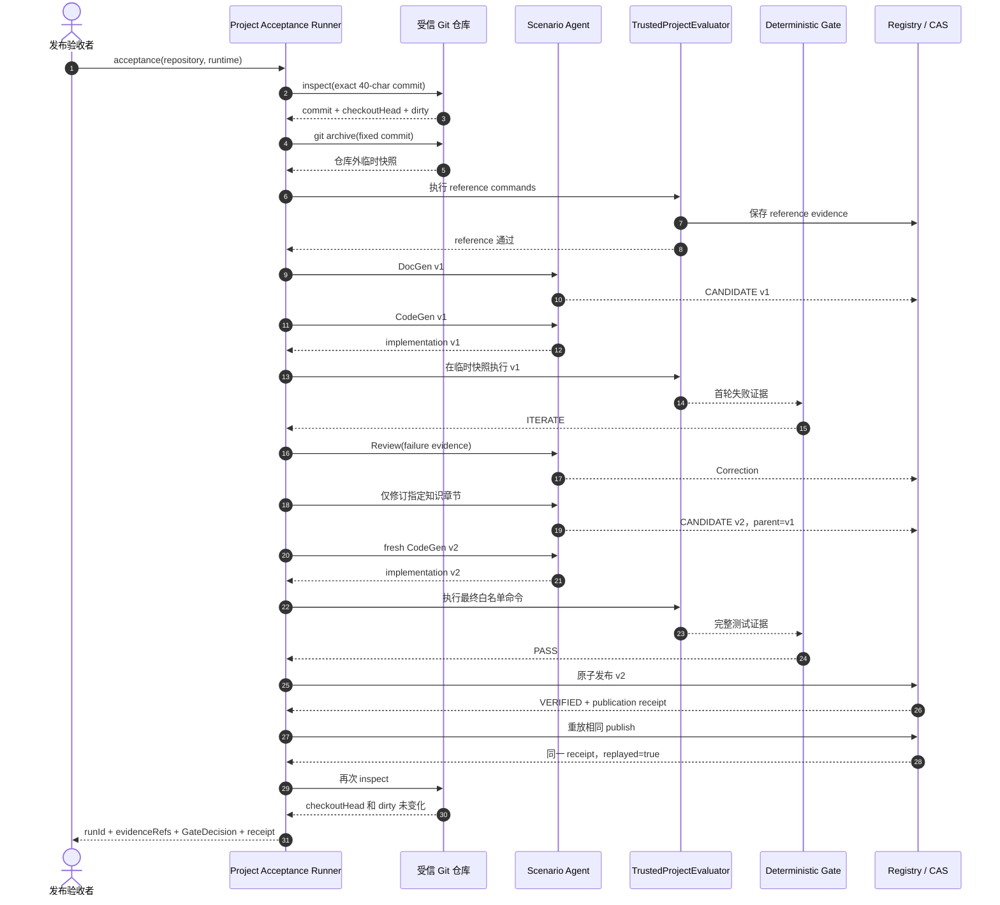
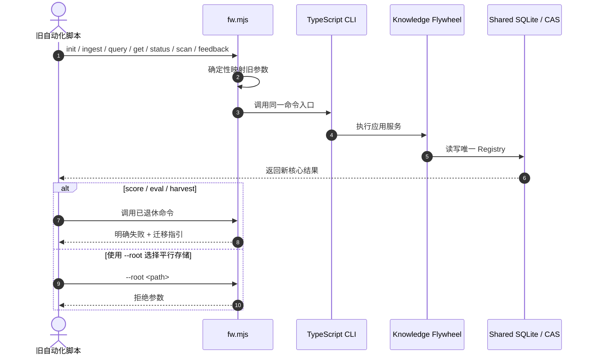
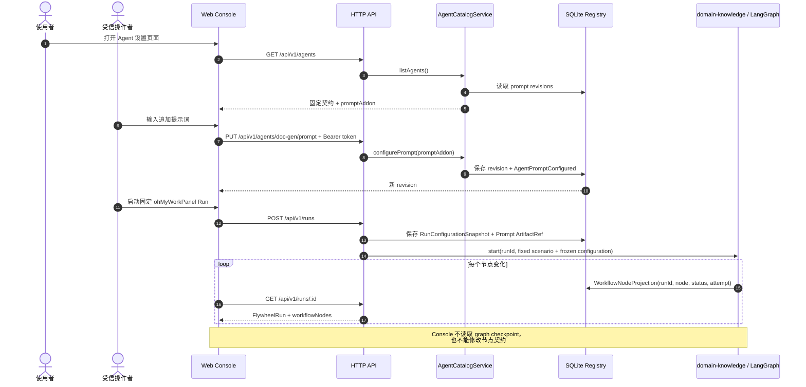

# 用户用例与交互时序

**状态：Accepted｜版本：1.2.0｜基线日期：2026-09-04**

本文把需求、验收场景和用户入口连接成可执行的交互视图。时序图中的“必须 / 不得”具有规范性；具体能力是否已经落地，以[追踪矩阵](../13-verification/traceability-matrix.md)为准。

这些用例的页面信息架构、交互状态、API 需求和产品验收见[前台产品设计](../04-product/frontend-product-design.md)。

## 用例目录

| 用例 ID | 主要用户 | 用户目标 | 需求与验收映射 |
|---|---|---|---|
| UC-KF-001 | 知识消费者 | 只使用已验证知识并提交反馈 | KF-SYS-006、KF-SYS-016；AC-OBS-001、AC-COMPAT-001 |
| UC-KF-002 | 知识治理者 | 将有来源的候选知识经独立评测发布为 `VERIFIED` | KF-SYS-005、KF-SYS-006、KF-SYS-009、KF-SYS-015；AC-EVAL-002、AC-PUB-001 |
| UC-KF-003 | 工程师（启动与异常治理） | 启动由 Workflow Service 自动驱动的失败归因、局部修订与 fresh 再生成 | KF-SYS-001、KF-SYS-007、KF-SYS-008；AC-FLOW-001、AC-FLOW-002、AC-FLOW-003 |
| UC-KF-004 | 发布验收者 | 对固定 commit 完成可复验的真实源码闭环 | KF-SYS-017、NFR-011；AC-E2E-001 |
| UC-KF-005 | 旧 Runner 调用方 | 保持旧命令可用且不产生第二套事实源 | KF-SYS-016；AC-COMPAT-001 |
| UC-KF-006 | 受信操作者 | 查阅全部 Agent 和节点状态，并只追加提示词 | KF-SYS-020、KF-SYS-021；AC-OBS-002、AC-AGENT-003 |
| UC-KF-007 | 本地管理员 | 在设置中配置模型 API 并以 Pi Agent 工具作为默认任务执行方式 | KF-UI-021；AC-UI-024 |

## 参与者与责任

| 参与者 | 责任 |
|---|---|
| 知识消费者 | 查询、读取和反馈；不授予知识发布权限。 |
| 知识治理者 | 提交来源、候选内容、策略和由受信评测器产生的证据；只在 Gate `PASS` 后请求发布。 |
| 工程师 | 启动 Run、选择策略，并处理 `STOPPED`、`LOW_CONFIDENCE` 或需要批准的异常；不得代替 Gate 判定结果。 |
| OrchestratorAgent | 生成节点 DAG、资源声明和委派计划；不写知识、实现或测试，也不决定 Gate 结果。 |
| Workflow Service | 按计划自动推进 Run、调用 Agent、持久化 checkpoint，并根据确定性 Gate 选择下一条状态边。 |
| DocGen / CodeGen / Review | 分别生成知识、实现和 Correction；职责及可见数据受权限矩阵限制。 |
| EvalRunner | 独立执行构建与测试，提交不可变执行证据。 |
| Deterministic Gate | 根据固化策略和证据产生 `PASS / ITERATE / ROLLBACK / STOPPED`。 |
| Knowledge Publisher | 在一个事务中更新知识、Run、事件和 publication receipt。 |
| 受信操作者 | 查看固定 Agent 契约和执行状态；只能追加提示词，不能改职责、Schema、拓扑或工具权限。 |
| 本地管理员 | 配置模型 API URL 和 API Key、验证连通性并启用默认 Pi Agent 工具；不能从界面读回完整密钥。 |

## UC-KF-007：配置模型 API 并启用 Pi Agent

### 前置条件与结果

- 用户已进入治理模式并具有本地管理员权限。
- “设置”允许填写 API URL 与 API Key，并在保存前或保存后执行一次不产生领域副作用的连接测试。
- API Key 只能提交给服务端凭据边界，不得写入 URL、日志、浏览器本地存储、运行快照或普通配置查询响应；后续查询只返回“已配置”和脱敏提示。
- API URL 必须经过协议、主机和重定向策略校验，防止任意内网探测；错误必须区分地址无效、鉴权失败、模型不可用和超时。
- 有效配置启用后，新任务默认由 Pi Agent 工具执行。Pi Agent 仍受既有 Agent 契约、工具权限、工作区隔离、超时、审计和确定性 Gate 约束，不能获得发布权限或绕过评测。
- 已经冻结为 `pi-agent` 的批次在验证过期、配置不可用或恢复摘要不匹配时必须失败关闭，不得回退到演示 Provider。没有启用有效 Pi 配置的新批次使用部署时明确公开的 fallback Provider；默认 fixture 只用于本地验收，`GET /api/v1/system/capabilities` 必须如实标识，不能伪装为真实模型执行。

### 已实现接口

| 目的 | 接口 | 最小语义 |
|---|---|---|
| 读取配置状态 | `GET /api/v1/provider-settings` | 返回 Provider 类型、脱敏 API URL、Key 是否已配置、验证状态和最近验证时间，不返回完整 Key。 |
| 保存配置 | `PUT /api/v1/provider-settings` | 接收 `provider=pi-agent`、API URL 和可选的新 API Key；需要管理员鉴权、幂等与审计。 |
| 验证连接 | `POST /api/v1/provider-settings/verify` | 使用服务端持有的待验证或已保存凭据执行无副作用探测，返回分类结果。 |

该用例已在 DEV-007 实现。保存配置不会自动启用；只有无副作用探测成功且操作者请求启用时，后续新批次才冻结 `pi-agent`、模型和非秘密参数摘要。已经冻结为 Pi 的批次在验证过期、设置变更或恢复摘要不匹配时失败关闭；尚未冻结 Pi 的新批次使用可见的部署 fallback。

## UC-KF-001：查询已验证知识并反馈

### 前置条件与结果

- Registry 已初始化，并且至少存在一个已通过行为门禁的 `VERIFIED` 版本。
- 未显式指定状态时，查询必须只返回 `VERIFIED` 知识。
- 反馈必须形成独立记录，不得直接修改知识正文、状态或 GateDecision。



### 用户入口

| 目的 | 入口 |
|---|---|
| 查询 | `npm run knowledge -- query --q <text>` |
| 精确读取 | `npm run knowledge -- get --module <module-id>` 或 `--version <version-id>` |
| 反馈 | `npm run knowledge -- feedback --module <module-id> --action hit\|rate\|correct` |
| 图形界面 | 启动 `npm run knowledge:serve` 后访问本地 Dashboard |
| Agent/DSH | `wp_knowledge_query`、`wp_knowledge_feedback`；不得发布 |

## UC-KF-002：从候选到 VERIFIED

### 前置条件与结果

- 知识治理者必须提供稳定 `moduleId`、非空 Markdown 和至少一个 provenance。
- Quality Gate 的 `ACCEPTED` 只允许候选进入行为评测，不代表知识正确。
- 通用 `evaluate` 入口只接收受信评测报告，不负责启动编译或测试进程。
- 只有与 Run、版本和证据范围一致的 `PASS` 决策可以发布。



### 用户操作顺序

```text
init
  → ingest
  → create-run
  → transition PLANNED
  → transition GENERATING
  → transition EVALUATING
  → 在独立环境执行测试
  → evaluate
  → 若 PASS，则 publish
```

Run、version、decision 和 evidence ID 必须由前一步返回值传给下一步，不得按名称猜测或跨 Run 复用。

## UC-KF-003：失败归因与知识迭代

### 前置条件与结果

- 当前 Run 已在 `REVIEWING`，且 Gate 结果为 `ITERATE` 或 `ROLLBACK`。
- 工程师只负责启动 Run、固化策略和处理异常；正常迭代必须由 Workflow Service 自动驱动到终态，不要求工程师逐节点推进。
- OrchestratorAgent 只生成计划和委派关系，不得决定下一状态；状态转换只能接受确定性 GateDecision。
- Review 必须输出包含知识路径、判据、证据和风险的结构化 Correction。
- DocGen 只能修改 Correction 指定的知识范围；人工修订同样只能产生新候选。
- CodeGen 必须在 fresh 工作区根据新知识重新生成，不得读取上一轮实现或参考实现。



发布后的人工修改不得原地覆盖 `VERIFIED` 内容，而必须创建新 KnowledgeVersion 和新 Run，重新执行本用例。工程师可以取消 Run 或处理治理请求，但不得在正常迭代中代替 Workflow Service 手工选择下一条状态边。

## UC-KF-004：固定 commit 的真实源码发布验收

### 前置条件与结果

- 用户提供包含场景所固定 commit 的受信 Git 仓库。
- 系统必须通过 `git archive` 在源仓库外创建临时快照，不得 checkout、覆盖或清理用户工作区。
- 可重复测试默认使用 SchemaValidatedScenarioAgent；真实 Agent 演示可切换 DeepSeek Harness Provider。单次 live 结果只能证明接线和一次样例，不代表模型稳定性。
- TrustedProjectEvaluator 不是敌对代码沙箱；来源或生成代码不受信时必须拒绝运行。



### 用户入口

```text
npm run acceptance:ohmyworkpanel --
  --repository <受信仓库路径>
  --runtime <仓库外运行目录>
  --output summary
```

固定 commit 来自场景定义；用户不得用任意分支 HEAD 隐式替换。完整流程和证据要求见[真实源码验收工作流](real-source-acceptance.md)。

## UC-KF-005：旧 Runner 兼容调用

### 前置条件与结果

- 旧调用方继续以 `fw.mjs` 作为进程入口。
- 兼容层必须和新 CLI 共用 `WP_FLYWHEEL_HOME` 指向的 SQLite/CAS。
- 兼容层不得实现第二套状态机、评分权威、定时器或发布路径。



旧 `verified` 查询状态映射到 `VERIFIED`，旧 `draft` 映射到 `CANDIDATE`；旧 `eval` 不得映射到新发布流程，因为它缺少完整行为证据和 Gate 权威。

## UC-KF-006：查阅 Agent、节点状态和受限提示词定制

### 前置条件与结果

- Console 必须展示 Orchestrator、DocGen、DocWorker、TestGen、Code、Check、Review 七个固定角色。
- 所有人可以查看职责、输入、输出、基础提示词、工具权限和运行节点投影。
- 只有配置写 token 的受信操作者可以维护 `promptAddon`；未知 Agent、额外字段、超长或含空字符的内容必须拒绝。
- 修改只影响后续 Agent 调用，不改变基础提示词、职责、Schema、拓扑、输入输出或工具权限。



## 接口与权限约束

| 接口 | 适用用户 | 能力边界 |
|---|---|---|
| CLI | 本地知识治理者 | 支持完整候选、Run、评测报告录入和发布操作。 |
| Console / HTTP GET | 本地治理者与知识消费者 | 只读治理目录默认包含全部知识状态；知识消费者与 DSH Adapter 必须显式提交 `status=VERIFIED`。 |
| HTTP POST | 受信本地治理者 | 未配置写 token 时返回 `503`；Bearer token 无效时返回 `401`。 |
| DSH Adapter | Agent 消费者 | 查询、状态、扫描、候选录入和反馈；不能发布。 |
| Legacy facade | 旧自动化 | 只映射保留命令；不能恢复旧评分或发布语义。 |
| Project acceptance | 发布验收者 | 仅用于固定 commit、受信源码和白名单命令。 |
| Agents / workflow commands | 受信操作者 | 公开读取固定 Agent 和节点投影；写 token 只允许追加提示词、启动/恢复/取消固定工作流。 |

所有写入口最终必须经过同一 Application Service、Registry 和 CAS。入口差异不得改变 `CANDIDATE → EvaluationReport → GateDecision → VERIFIED` 的权威链。

## 最终前台入口映射

- UC-KF-001 通过“知识”页面筛选 `VERIFIED` 后完成查询、详情、provenance 与 feedback；面向消费者的 DSH 查询固定显式传入 `status=VERIFIED`。“添加知识”调用 ingest 时必须描述为创建候选，不得描述为人工发布或直接策展为 `VERIFIED`。
- UC-KF-003 通过“操作中心、飞轮批次、工作流图”呈现。操作中心读取持久化事项、严重级别、允许动作和审计历史；运行、Gate、组件和来源事实按确定性规则投影，安全事实仍随后续完整权限审计补齐。
- UC-KF-006 通过“Agent 设置”和批次工作台呈现，固定契约与可编辑的 `promptAddon` 必须分区，WorkflowNodeProjection 与 FlywheelRun 状态必须分开标注。
- “来源”页面默认读取持久化来源注册，并支持创建、启停、更新和刷新；`GET /api/v1/sources/scan` 只有在用户明确扫描时作为候选辅助视图，不得覆盖注册事实。Preview 不提供删除语义。
- 产品 UI 不得调用 `/api/v1/transition`、`/api/v1/evaluate` 或 `/api/v1/publish` 模拟自动工作流。Graph 必须使用注册中的真实节点投影；Health、Activity、Action Item、血缘、差异、评测、来源和 Provider 能力均读取服务端事实，无样本时显示 Empty/Partial/`—`。ETA 仍未实现，不能由浏览器猜测。

## 当前实现边界

- UC-KF-001、UC-KF-002 的核心存储、查询、评测录入和发布路径已实现；通用评测的进程执行仍由独立受信评测器负责。
- UC-KF-003 的状态、Correction 薄切片、增量修订、fresh 再生成和 PASS 后发布已由内嵌 LangGraph 在固定场景自动编排；通用候选的 CLI 仍支持人工逐步治理。自动 historical-best `ROLLBACK` 和生产沙箱仍按追踪矩阵标为 `Partial` 或 `Planned`。
- UC-KF-004 已以确定性 Scenario Agent 和受信 ProjectEvaluator 实现，不得外推为真实 GLM 质量或敌对代码隔离证明。
- UC-KF-005 已实现为兼容门面，且不拥有发布能力。
- UC-KF-006 已实现固定 Agent 目录、提示词 revision/audit、工作流节点投影和 Console 页面；它不允许可变拓扑或替换节点契约。
- UC-KF-007 已实现安全配置、脱敏读取、无副作用验证、默认 Pi Agent 批次快照和运营指标；自动化使用本地模拟的 OpenAI-compatible 上游验证真实 Pi SDK 执行路径，实际外部凭据仍由部署者在本地人工验收。
